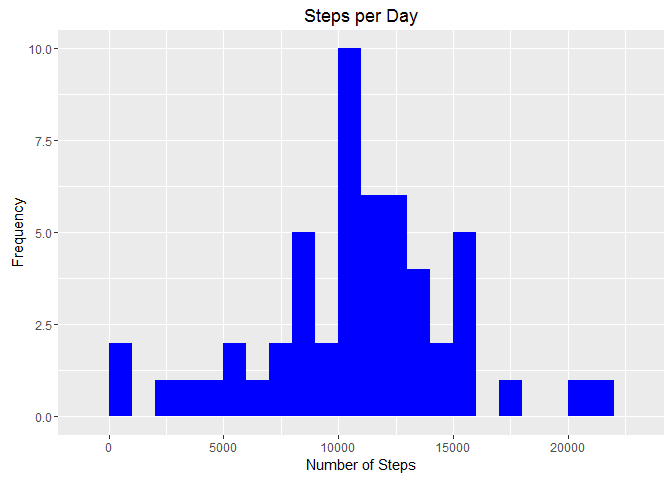
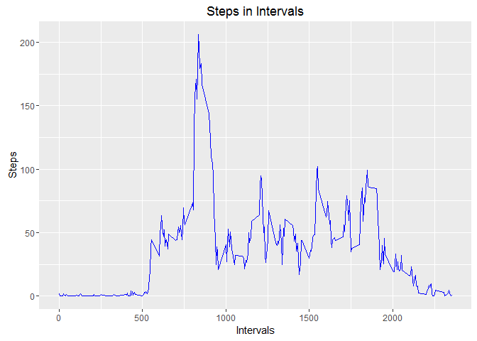
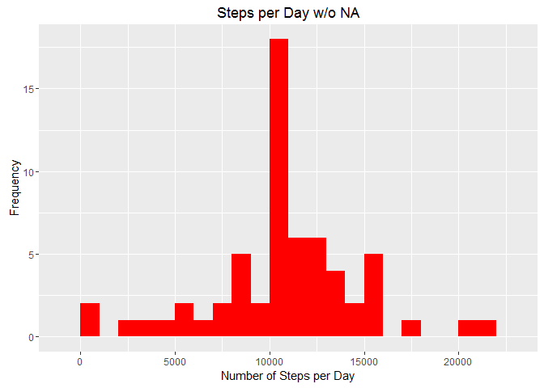

# Reproducible Research: Peer Assessment 1

```r
####Load packages that will be used

library(dplyr)
```

```
## Warning: package 'dplyr' was built under R version 3.2.3
```

```
## 
## Attaching package: 'dplyr'
```

```
## The following objects are masked from 'package:stats':
## 
##     filter, lag
```

```
## The following objects are masked from 'package:base':
## 
##     intersect, setdiff, setequal, union
```

```r
library(lubridate)
```

```
## Warning: package 'lubridate' was built under R version 3.2.3
```

```r
library(knitr)
```

----------------------------------------------------------------------

```r
# Loading and preprocessing the data
####Load the CSV file using "read.csv"

fbdata<-read.csv("activity.csv")

####Arrange the date as year-month-day

fbdata$date<-ymd(fbdata$date)
```

----------------------------------------------------------------------

```r
# What is mean total number of steps taken per day?
####Add the steps by day filtering na and create a histogram

stp_day<-fbdata %>%
filter(!is.na(steps)) %>%
group_by(date) %>%
summarize(steps=sum(steps)) %>%
print
```

```
## Source: local data frame [53 x 2]
## 
##          date steps
##        (time) (int)
## 1  2012-10-02   126
## 2  2012-10-03 11352
## 3  2012-10-04 12116
## 4  2012-10-05 13294
## 5  2012-10-06 15420
## 6  2012-10-07 11015
## 7  2012-10-09 12811
## 8  2012-10-10  9900
## 9  2012-10-11 10304
## 10 2012-10-12 17382
## ..        ...   ...
```

```r
####Load ggplot2 to create the histogram using geom_histogram

library(ggplot2)
```

```
## Warning: package 'ggplot2' was built under R version 3.2.3
```

```r
ggplot(stp_day, aes(x=steps)) +
geom_histogram(fill="blue",binwidth=1000) +
labs(title="Steps per Day",x="Number of Steps",y="Frequency")
```



```r
####Calcualte the mean and median for the steps taken each day

stpmean <- mean(stp_day$steps)
stpmedian<-median(stp_day$steps)
```

---------------------------------------------------------------------

```r
# What is the average daily activity pattern?
####Calculate the mean for each interval for all days and create a plot using geom_line with ggplot.

stpint<-fbdata %>%
filter(!is.na(steps)) %>%
group_by(interval) %>%
summarize(steps=mean(steps)) %>%
print
```

```
## Source: local data frame [288 x 2]
## 
##    interval     steps
##       (int)     (dbl)
## 1         0 1.7169811
## 2         5 0.3396226
## 3        10 0.1320755
## 4        15 0.1509434
## 5        20 0.0754717
## 6        25 2.0943396
## 7        30 0.5283019
## 8        35 0.8679245
## 9        40 0.0000000
## 10       45 1.4716981
## ..      ...       ...
```

```r
ggplot(stpint, aes(x=interval, y= steps)) +
geom_line(color="blue") +
labs(title="Steps in Intervals", x="Intervals", y="Steps")
```



```r
####Calculating interval with the most steps

stpint[which.max(stpint$steps),]
```

```
## Source: local data frame [1 x 2]
## 
##   interval    steps
##      (int)    (dbl)
## 1      835 206.1698
```

---------------------------------------------------------------------

```r
# Imputing missing values
####Calculate and report all the missing values from the data set, fbdata.  Fill all the values with the mean for the given 5-minute interval.

sum(is.na(fbdata$steps))
```

```
## [1] 2304
```

```r
fbdata_na<-fbdata
meanint<- tapply(fbdata_na$steps, fbdata_na$interval, mean, na.rm=TRUE, simplify=TRUE)
sumnas<-is.na(fbdata_na$steps)

fbdata_na$steps[sumnas]<-meanint[as.character(fbdata_na$interval[sumnas])]

####Make sure there are no missing values.
sum(is.na(fbdata_na$steps))
```

```
## [1] 0
```

```r
####Calculate the number of steps taken in each of the 5-minute interval and use ggplot to create a histogram for the full data set.
complete_data<-fbdata_na %>%
filter(!is.na(steps)) %>%
group_by(date) %>%
summarize(steps=sum(steps)) %>%
print
```

```
## Source: local data frame [61 x 2]
## 
##          date    steps
##        (time)    (dbl)
## 1  2012-10-01 10766.19
## 2  2012-10-02   126.00
## 3  2012-10-03 11352.00
## 4  2012-10-04 12116.00
## 5  2012-10-05 13294.00
## 6  2012-10-06 15420.00
## 7  2012-10-07 11015.00
## 8  2012-10-08 10766.19
## 9  2012-10-09 12811.00
## 10 2012-10-10  9900.00
## ..        ...      ...
```

```r
ggplot(complete_data, aes(x=steps)) +
geom_histogram(fill="red",binwidth=1000) +
labs(title="Steps per Day w/o NA",x="Number of Steps per Day",y="Frequency")
```



```r
####Calculate the new mean and median with the added values.

stpmean_full<-mean(complete_data$steps, na.rm=TRUE)
stpmedian_full<-median(complete_data$steps, na.rm=TRUE)
```

----------------------------------------------------------------------

```r
# Are there differences in activity patterns between weekdays and weekends?

fbdata_na<-mutate(fbdata_na, weektype=ifelse(weekdays(fbdata_na$date)=="Saturday"|weekdays(fbdata_na$date)=="Sunday", "weekend", "weekday"))
fbdata$weektype<-as.factor(fbdata_na$weektype)
head(fbdata_na)
```

```
##       steps       date interval weektype
## 1 1.7169811 2012-10-01        0  weekday
## 2 0.3396226 2012-10-01        5  weekday
## 3 0.1320755 2012-10-01       10  weekday
## 4 0.1509434 2012-10-01       15  weekday
## 5 0.0754717 2012-10-01       20  weekday
## 6 2.0943396 2012-10-01       25  weekday
```

```r
fbdata_na_interval<-fbdata_na %>%
group_by(interval, weektype) %>%
summarize(steps=mean(steps))

plots<-ggplot(fbdata_na_interval, aes(x=interval, y= steps, color=weektype)) +
geom_line() +
facet_wrap(~weektype, ncol=1, nrow=2)

print(plots)
```


